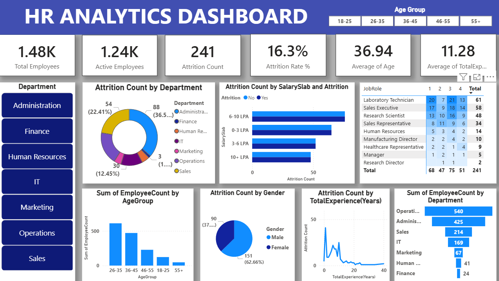

# HR-Analytics-Power-BI-Dashboard
Developed an interactive HR Analytics Dashboard in Power BI to analyze workforce demographics, employee attrition trends, departmental performance, and workforce distribution. The dashboard provides HR teams and management with actionable insights to support data-driven decision-making, improve employee retention, and optimize workforce planning.
# 📊 HR Analytics Dashboard | Power BI



## 📖 Project Overview

The HR Analytics Dashboard is an interactive Business Intelligence solution developed using Power BI to help organizations monitor workforce performance, analyze employee attrition, and identify key HR trends.

The dashboard transforms raw HR data into actionable insights, enabling HR teams and management to make informed decisions regarding employee retention, workforce planning, and organizational performance.

---

## 🎯 Business Problem

Employee attrition can significantly impact organizational productivity and increase hiring and training costs. HR departments often struggle to identify the key factors contributing to employee turnover.

This dashboard was designed to:

- Monitor employee attrition rates.
- Analyze workforce demographics.
- Identify departments with high employee turnover.
- Understand attrition patterns across salary groups, job roles, and experience levels.
- Support data-driven HR decision-making.

---

## 📌 Key Performance Indicators (KPIs)

| KPI | Value |
|------|------|
| Total Employees | 1,480 |
| Active Employees | 1,241 |
| Attrition Count | 241 |
| Attrition Rate | 16.3% |
| Average Age | 36.94 Years |
| Average Experience | 11.28 Years |

---

## 📊 Dashboard Components

### 1. Attrition Analysis
- Attrition Count by Department
- Attrition Count by Salary Slab
- Attrition Count by Gender
- Attrition Count by Total Experience

### 2. Workforce Demographics
- Employee Distribution by Age Group
- Department-wise Employee Count
- Interactive Age Group Filtering

### 3. Employee Satisfaction Analysis
- Job Role vs Job Satisfaction Matrix
- Identification of roles with higher attrition risk

### 4. Interactive Filtering
- Department Slicer
- Age Group Slicer
- Dynamic Cross Filtering Across Visuals

---

## 🔍 Key Insights

### Department-wise Attrition
- Sales department contributes the highest employee attrition.
- Human Resources and Finance departments show comparatively lower attrition rates.

### Salary-based Attrition
- Employees in lower and mid-level salary brackets exhibit higher attrition rates.
- Compensation appears to be a significant factor influencing employee turnover.

### Age Group Analysis
- Majority of employees belong to the 26–35 age group.
- Attrition is concentrated among younger employees early in their careers.

### Experience Analysis
- Employees with lower years of experience are more likely to leave the organization.
- Attrition decreases as employee experience increases.

### Gender Analysis
- Male employees account for a larger share of attrition compared to female employees.

---

## 🛠️ Tools & Technologies Used

| Technology | Purpose |
|------------|---------|
| Power BI Desktop | Dashboard Development |
| Power Query | Data Cleaning & Transformation |
| DAX | Measures & Calculations |
| Data Modeling | Relationship Management |
| Data Visualization | Business Reporting |

---

## 📈 DAX Measures Used

Examples of measures created during the project:

```DAX
Employee Count = COUNT(Employee[EmployeeNumber])

Attrition Count =
CALCULATE(
    COUNT(Employee[Attrition]),
    Employee[Attrition] = "Yes"
)

Attrition Rate =
DIVIDE([Attrition Count],[Employee Count],0)

Active Employees =
[Employee Count] - [Attrition Count]
